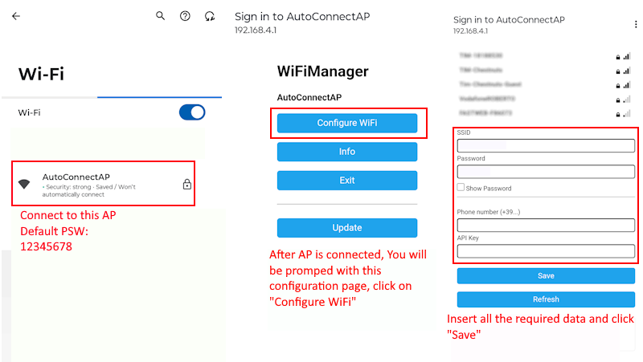

# STM32-Smart-Alarm

Smart alarm system based on STM32 as the main microcontroller, interfaced with ESP32 for WiFi communications.

## Introduction

This project is an advanced alarm system designed for home and office security. It combines multi-factor authentication, environmental monitoring, and remote notifications through:

- Authentication via keypad and RFID  
- Detection of door/window openings and motion  
- Real-time WhatsApp notifications  
- User interface on OLED display

[](https://www.youtube.com/watch?v=71LS64RbG-M)

## Hardware Components

- **STM32 Nucleo-64 Board**: Main processing unit 
- **ESP32 Wemos S2 mini Module**: WiFi handling and notifications  
- **128x64 I2C OLED Display**: User interface  
- **4x4 Matrix Keypad**: PIN code entry  
- **Reed Switch Sensor**: Door/window opening detection  
- **RC522 RFID Module**: Badge-based authentication  
- **HC-SR501 PIR Sensor**: Motion detection  
- **Active Buzzer**: Acoustic siren  

## System Architecture


The system is divided into two main units:

1. **STM32 Nucleo-64**:
   - Sensor and alarm logic management  
   - Display and user interface control  
   - I2C communication with ESP32  

2. **ESP32 Wemos S2 mini**:
   - WiFi connection and notifications  
   - Web interface configuration  
   - WhatsApp message dispatch  


## Key Features

### 1. 4x4 Matrix Keypad

Used for PIN code input:

- 8 total pins (4 rows as output, 4 columns as input)  
- Integrated software debounce (500 ms)  
- Visual feedback during entry  

  
*Credits: [Antonio Mancuso's Blog](https://mancusoa74.blogspot.com/2017/02/scratch-e-arduino-progetto-6-tastierino.html)*

```c
static const char keypad[4][4] = {
    {'1','2','3','A'},
    {'4','5','6','B'},
    {'7','8','9','C'},
    {'*','0','#','D'}
};
```

### 2. RC522 RFID Reader

- Mifare tag authentication  
- Support for multiple authorized badges  
- PIN prompt after badge recognition  
- SPI configuration with prescaler set to 32  

### 3. Alarm System

**Triggers**:

- Door/window openings (reed switch)  
- Unauthorized movements (PIR sensor)   

**Actions**:

- Activate buzzer  
- Immediate WhatsApp alert  
- OLED display blinking  

### 4. Security Management

- Two-factor authentication (RFID + PIN)  
- Temporary lockout after 3 failed attempts (configurable)  
- PIN codes stored in flash memory   

## Firmware flowchart


## Project Status

### Hardware:

- [x] Schematic creation  
- [ ] Full component testing  
- [x] Integrated shield development  

### STM32 Firmware:

- [x] Display initialization  
- [x] Flash-based PIN management  
- [ ] PIN setup procedure  
- [x] Alarm functions  
- [ ] Complete RFID logic  
- [x] Reed switch via interrupt  
- [x] PIR sensor integration  
- [x] I2C communication with ESP32  

### ESP32 Firmware:

- [x] WiFi connection  
- [x] IP information dispatch  
- [x] WhatsApp notifications  

## Installation

### Prerequisites

- STM32CubeIDE for STM32 development  
- Arduino IDE for ESP32 programming  
- Required libraries (see section below) 

## Libraries Used

This project makes use of the following open-source libraries:
- [STM32 SSD1306 library](https://github.com/afiskon/stm32-ssd1306): For interfacing with the OLED display.
- [RFID-MIFARE-RC522-ARM-STM32](https://github.com/Hamid-R-Tanhaei/RFID-MIFARE-RC522-ARM-STM32/tree/main): For interfacing with the RC522 RFID scanner
- [WiFiManager](https://github.com/tzapu/WiFiManager): Simplifies WiFi connectivity setup.

### Steps
1. **Clone the Repository**:
   ```bash
   git clone https://github.com/castagnoemanuele/STM32-smart-alarm.git
   cd STM32-smart-alarm
   ```

2. **Hardware Setup**:
   - Connect all components as per the provided schematic.
   - Ensure proper power supply and secure connections.

3. **Flashing the STM32**:
   - Open the project in STM32CubeIDE.
   - Compile the source code and flash it to the STM32 Nucleo-64 board.

4. **Flashing the ESP32**:
   - Open the ESP32 code in Arduino IDE.
   - Compile and upload the code to the ESP32 S2 mini board.

5. **WhatsApp Notification Setup**:
   - To receive WhatsApp notifications when an alarm is triggered, you need to obtain an API key from CallMeBot:
     1. Add the phone number +34 694 29 84 96 to your phone contacts (name it as you wish)
     2. Send the message "I allow callmebot to send me messages" to this contact via WhatsApp
     3. Wait to receive the message "API Activated for your phone number. Your APIKEY is XXXXXX" from the bot
     4. Enter your phone number (with international prefix) and the received APIKEY in the WiFiManager configuration interface
   - Note: If you don't receive the API key within 2 minutes, please try again after 24 hours.
   
   Example of activation message exchange with CallMeBot:
   
   

6. **ESP32 Setup**:
   - On power-up, connect to the "AutoConnectAP" network  
   - Enter WiFi credentials in the web interface  
   - Set phone number and WhatsApp API key  

   

## Usage

1. **Arming the system**:
   - Present RFID badge 
   - Press 'A' and enter your PIN  
   - Confirm with 'D'  

2. **Disarming**:
   - Present RFID badge  
   - Enter PIN when prompted  


## Technical Notes

### Known Issues

- For ESP32, use `driver/i2c.h` instead of `Wire.h`  
- RFID module requires SPI prescaler set to 32  
- Power RC522 with 5V for stability  

## License

This project is licensed under the [MIT License](LICENSE).

## Acknowledgments

Special thanks to the authors of the open-source libraries and the community for their valuable contributions.

---

**Future Developments**:

- Mobile app for remote control  
- Home Assistant integration  
- GSM module for SMS alerts  
- Multi-zone expansion  
