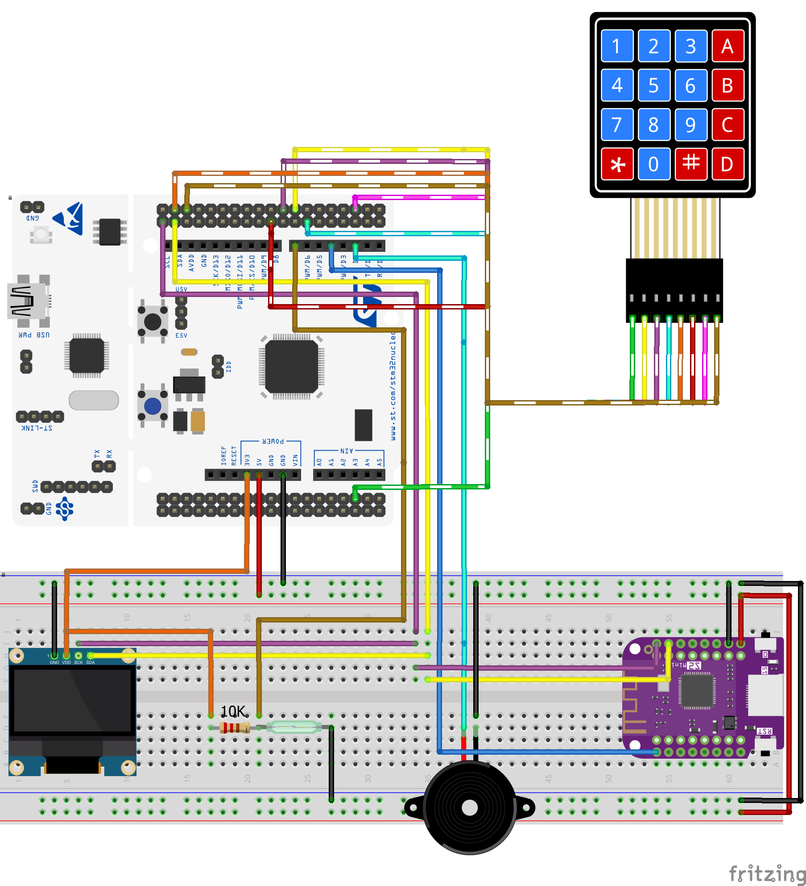
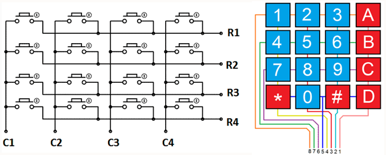

# STM32-Smart-Alarm

Smart alarm security system based on STM32 as the main microcontroller. It is interfaced with an ESP32 for WiFi communication.

## Introduction

This project is a smart alarm system designed to enhance home or office security. The system utilizes an STM32 microcontroller in conjunction with various sensors and modules to detect unauthorized access and notify users over WiFi. Features include keypad entry, RFID authentication, motion detection, and more.


[](https://www.youtube.com/watch?v=VkK-71LS64RbG-M)


## Components

The following hardware components are used in this project:
- **STM32 Nucleo-64 development board**: Main microcontroller.
- **Wemos ESP32 S2 mini board**: Handles WiFi communication.
- **I2C OLED Display**: Displays system status and prompts.
- **4x4 Numpad Array**: For PIN code entry.
- **Reed switch sensor board**: Detects door or window openings.
- **RC522 RFID module**: Provides RFID authentication.
- **HC-SR501 IR sensor**: Detects motion.
- **Active buzzer**: Alerts users with an audible alarm.

## Architecture


The smart alarm system is divided into two main components:
1. **STM32 Microcontroller**:
   - Handles sensor inputs, alarm logic, and display control.
2. **ESP32 WiFi Module**:
   - Manages network communication and sends notifications.

A detailed schematic and workflow diagram will be added in future updates.


# Features
## 4x4 button matrix
The 4x4 button matrix, also reffered to as the keypad in the code, is used to input the pincode to authenticate the user after he has presented his badge. it has 8 pins, 4 of these will be used as inputs, while the others will be used as outputs.

 

[Credits - Antonio Mancuso's Blog](https://www.google.com/url?sa=i&url=https%3A%2F%2Fmancusoa74.blogspot.com%2F2017%2F02%2Fscratch-e-arduino-progetto-6-tastierino.html&psig=AOvVaw3JqhFhCt8b6yLJ_VM6Uewu&ust=1746618144848000&source=images&cd=vfe&opi=89978449&ved=0CAMQjB1qFwoTCIj25uPhjo0DFQAAAAAdAAAAABAE)

The operation principle of the keypad is as picured above: the microcontroller activates one of the rows (which are the inputs of the keypad, connected to optput pins of the microcontroller) and then begins to check the outputs. If one of them is founs HIGH, then the apposite functions registers the input as described by this matrix:
```
   static const char keypad[4][4] = {
	     { '1', '2', '3', 'A' },
	     { '4', '5', '6', 'B' },
	     { '7', '8', '9', 'C' },
	     { '*', '0', '#', 'D' }
   };    
```
This check is performed in polling mode.

## RFID Card reader

## 

## To Do

### Hardware:
- [x] Create and upload the schematic for hardware connections.
- [ ] Test and validate all hardware components.
- [ ] Build a prototype shield that hosts ESP32 and I2C display on top of the STM32

### Firmware - STM32:
- [x] Initialize display
- [x] Add support for multiple PIN codes (saving to FLASH).
- [ ] Implement Pin Setting procedure
- [x] Display current informations on display function
- [x] Implement alarm function (Sound + Light) and arming and disarming the system
- [ ] Implement RFID authentication logic.
- [x] Implement Reed switch control via interrupt
- [ ] Integrate motion sensor functionality.
- [x] Implement connection via I2C with the ESP32
- [ ] 
- [ ] Improve code modularity


### Firmware - ESP32:
- [x] Implement WiFi Connection
- [x] Send IP/wifi information to STM32
- [ ] Develop a feature to send notifications via WiFi.

### Possible Future Enhancements:
- [ ] Add a mobile app for remote control.
- [ ] Integrate a camera module for visual monitoring.
- [ ] Expand compatibility with other microcontroller boards.


## Libraries Used

This project makes use of the following open-source libraries:
- [STM32 SSD1306 library](https://github.com/afiskon/stm32-ssd1306): For interfacing with the OLED display.
- [RFID-MIFARE-RC522-ARM-STM32](https://github.com/Hamid-R-Tanhaei/RFID-MIFARE-RC522-ARM-STM32/tree/main): For interfacing with the RC522 RFID scanner
- [WiFiManager](https://github.com/tzapu/WiFiManager): Simplifies WiFi connectivity setup.

## Installation and Setup

### Prerequisites
- Install STM32CubeIDE or your preferred STM32 development environment.
- Install the Arduino IDE for programming the ESP32.
- Ensure you have all the necessary hardware components.

### Steps
1. **Clone the Repository**:
   ```bash
   git clone https://github.com/castagnoemanuele/STM32-smart-alarm.git
   cd STM32-smart-alarm
   ```

2. **Hardware Setup**:
   - Connect all components as per the provided schematic (to be added).
   - Ensure proper power supply and secure connections.

3. **Flashing the STM32**:
   - Open the project in STM32CubeIDE.
   - Compile the source code and flash it to the STM32 Nucleo-64 board.

4. **Flashing the ESP32**:
   - Open the ESP32 code in Arduino IDE.
   - Compile and upload the code to the ESP32 S2 mini board.

5. **WiFi Configuration**:
   - When powered on, the ESP32 will start in AP mode.
   - Connect to the ESP32 via the provided WiFiManager interface to configure your WiFi credentials.

## Usage

- Enter the PIN code on the keypad to arm or disarm the alarm system.
- Use the RFID module to authenticate authorized users.
- The system will trigger the buzzer if unauthorized access is detected via reed switches or motion sensors.
- Monitor system status on the OLED display.

## Notes
- For the ESP32 firmware the standard <wire.h> library gave us many problems when using the esp32 as a slave devicce on the i2c bus. Changing the <Wire.h> to the standard <drivers/i2c.h> solved these problems.
- For the STM32, getting the RC522 to work was a lot of trouble, probably because our card reader was a cheap clone. Out of many things, to get it to work we had to set the SPI prescaler to 32, because the default value was too high for the RC522. Also it is possible that powering the chip with 5v instead of 3.3v helped.

## License

This project is licensed under the [MIT License](LICENSE).

## Acknowledgments

Special thanks to the authors of the open-source libraries and the community for their valuable contributions.
